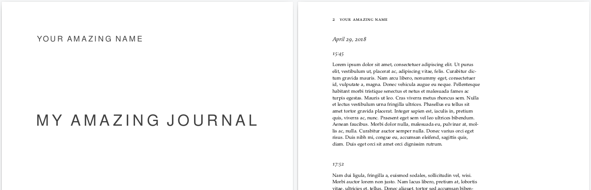

# JourTex
A daily journalling system that combines the simplicity of Markdown and the professionalism of Tufte design principles (as implemented using the Tufte-Latex package).



## Requirements
1. [**TexLive**](https://www.tug.org/texlive/) - duh
2. [**tufte-latex**](https://tufte-latex.github.io/tufte-latex/) - document class used for making the journal
2. [**pandoc**](https://pandoc.org/installing.html) - for converting markdown to tex

## Setup
1. Clone this repo
2. Modify the `\title` and the `\author` lines in [`texscript/Journal.tex`](texscript/Journal.tex) to your title and name.  
    ```latex
        \title {My Amazing Journal} 
        \author {Your Amazing Name} 
    ```
3. Execute jourtex.sh
    ```bash
        chmod a+x jourtex.sh
        ./jourtex.sh
    ```
    A new pdf file `Journal.pdf` should be created. On opening, your name and title should appear on the title page followed by two pages of example entries.

## Usage
The entire system works on structured directories. Store your Journal entries for the day as `year/month/day.md`. For example, the journal entries for April 29, 2018 should be stored in `2018/4/29.md`.

Every new timestamp should be a **H2 header** in markdown.
```markdown
    ## 15:45
    Something happened today wow.
    ## 17:56
    Yay.
```
 Using any other header would result in messed up formatting in the final pdf. Standard markdown formatting (**bold**, *italics*, ordered items) is supported. Images kind of work but may have weird positioning and errors. 

Pandoc supports using LaTeX commands in the markdown files. So, as long as we add `\usepackage{}` lines to `Journal.tex`, any LaTeX commands can be used within the markdown journal entries and have expected results in the final pdf. For instance, in [29.md](2018/4/29.md), the `\lipsum` tex command has been used for placeholder text. Any command present in the `tufte-latex` class can be used within the markdown for additional formatting and details. (Figures, margintext, footnotes)

After adding your entries, execute `jourtex.sh`. Your respective entries should now be added to Journal.pdf

## Possible Improvements
This small script was made purely to serve my needs for productivity. Its current state suffices for me but that does not imply it cannot be improved.
1. More user friendly setup for changing title and author.
2. App to add, edit and delete entries. (Automatically add entries for the current time)
3. More.

## [LICENSE](LICENSE)
MIT License Copyright (c) 2018 Gurupungav Narayanan

